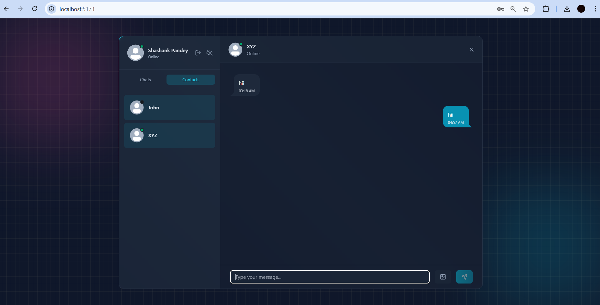
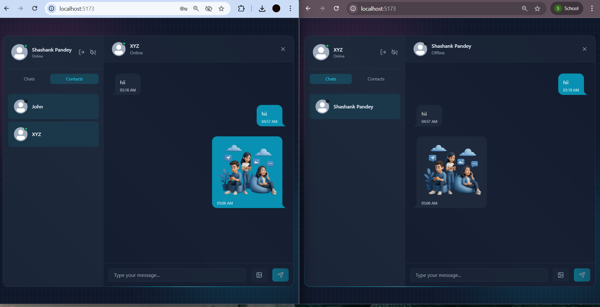
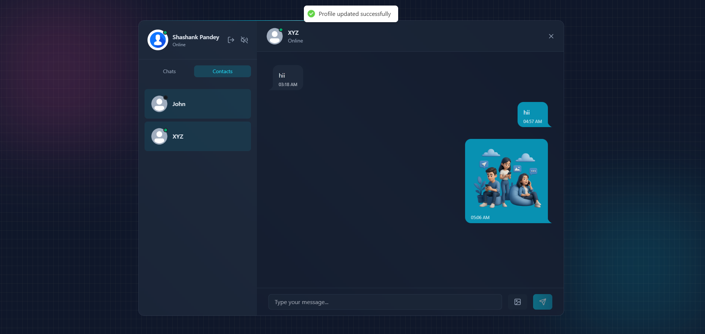

# 💬ECHO (Realtime Chat Application) 

A full-stack real-time chat application that enables users to sign up, log in securely, chat instantly, share images, and manage contacts — built with modern web technologies for speed, scalability, and a clean user experience.

## 🚀 Features

* ####  🔐 User Authentication 
    * Secure signup & login 
    * Send welcome mail after signup
    * JWT-based authentication with cookies

* ####  💬 Real-Time Messaging
    * Instant message delivery
    * Online/offline status handling

* #### 🖼️ Image & Media Sharing
    * Send images in chat
    * Smooth preview & rendering

* #### 📇 Contacts & Chat List
    * View all available contacts
    * Recent chats & active conversations

* #### 🧑‍💻 User Profile
    * Profile updates
    * Avatar / profile picture support

* #### ⚡ Fast & Responsive UI
    * Tailwind CSS for modern styling
    * Optimized for performance

## 🛠️ Tech Stack
#### Frontend
    ⚛️ React + Vite
    🎨 Tailwind CSS
    🗂️ Zustand (State Management)
    🌐 Axios

#### Backend
    🟢 Node.js
    🚂 Express.js
    🗄️ MongoDB (Mongoose)
    🔐 JWT Authentication
    🍪 Cookie-based auth
    🔒 Arcjet (Security & rate limiting)

## 📸 Screenshots

#### 🔹 Signup Page

#### 🔹 Welcome Mail

#### 🔹 Login Page

#### 🔹 Contact List

#### 🔹 Chat Interface

#### 🔹 Real-Time Messaging

#### 🔹 Image / Media Sharing

#### 🔹 Porfile Pic Update

## ⚙️ Installation & Setup
#### 1️⃣ Clone the Repository
    git clone https://github.com/your-username/realtime-chat-app.git
    cd realtime-chat-app

#### 2️⃣ Backend Setup
    cd backend
    npm install

    Create a .env file:
        PORT=3000
        MONGO_URI=your_mongodb_uri
        JWT_SECRET=your_jwt_secret
        NODE_ENV=development
        CLIENT_URL=http://localhost:5173

    Start the backend:
        node src/server.js

##### Backend runs on:
    http://localhost:3000

#### 3️⃣ Frontend Setup
    cd frontend
    npm install
    npm run dev

##### Frontend runs on:
    http://localhost:5173

## 📂 Project Structure
    realtime-chat-app/
    │
    ├── backend/
    │   ├── node_modules/
    │   ├── src/
    │   │   ├── controllers/
    │   │   ├── emails/
    │   │   ├── lib/
    │   │   ├── middleware/
    │   │   ├── models/
    │   │   ├── routes/
    │   │   └── server.js
    │   │
    │   ├── .env
    │   └── package.json
    │
    ├── frontend/
    │   ├── dist/
    │   ├── node_modules/
    │   ├── public/
    │   ├── src/
    │   │   ├── components/
    │   │   ├── hooks/
    │   │   ├── lib/
    │   │   ├── pages/
    │   │   ├── store/
    │   │   ├── App.jsx
    │   │   ├── index.css
    │   │   └── main.jsx
    │   │
    │   ├── index.html
    │   ├── eslint.config.js
    │   ├── postcss.config.js
    │   ├── tailwind.config.js
    │   ├── vite.config.js
    │   ├── package.json
    │   ├── package-lock.json
    │   └── README.md
    │
    ├── .gitignore
    └── package.json
    └── README.md

## 🔐 Security Highlights

* Password hashing using bcrypt
* Protected routes with JWT
* Cookie-based authentication
* API protection using Arcjet

## 🧠 Future Improvements
✅ Typing indicators 
✅ Message read receipts 
✅ Group chats 
✅ Voice & video calling 
✅ Message search

## 🤝 Contributing
Contributions are welcome! 
Feel free to fork the repository and submit a pull request.

## 👨‍💻 Author
**Shashank Pandey **

